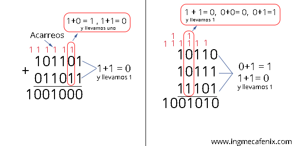
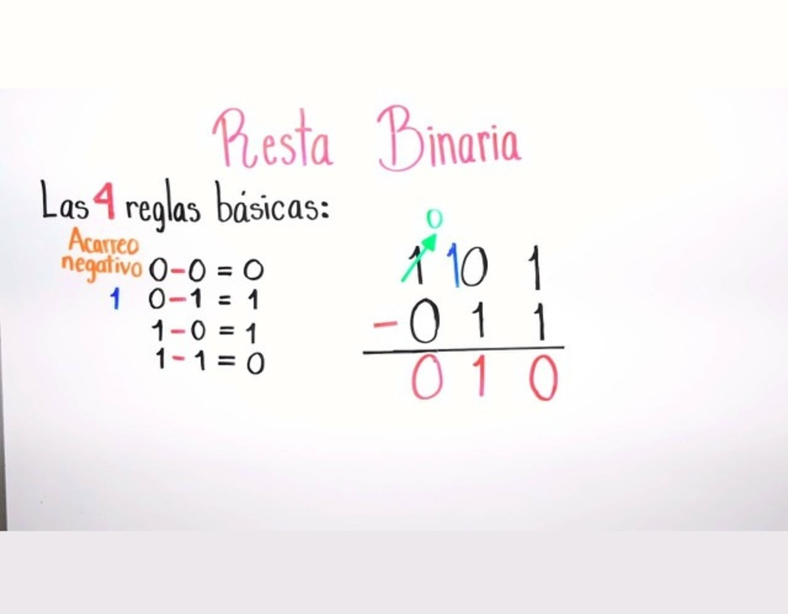

## Definición de Lógica Computacional

- La lógica computacional es una rama de la lógica matemática que se enfoca en el uso de conceptos lógicos para resolver problemas en informática y computación. Se basa en la lógica proposicional y en la lógica de predicados, proporcionando un marco para la representación, análisis y manipulación de información de manera formal.

## Objetivo de la Lógica Computacional
- El objetivo principal de la lógica computacional es proporcionar una base teórica y práctica para la resolución de problemas relacionados con el procesamiento de información y la toma de decisiones en sistemas computacionales

- **Desarrollar algoritmos efectivos**: La lógica ayuda a formular y analizar algoritmos para garantizar su corrección y eficiencia.
- **Diseñar circuitos digitales**: La lógica computacional es fundamental para el diseño de circuitos digitales y sistemas electrónicos.
- **Garantizar la corrección del software**: La lógica permite verificar y validar que el software se comporte de acuerdo con las especificaciones.
- **Resolver problemas complejos**: Aplicar técnicas lógicas para resolver problemas complejos en áreas como inteligencia artificial, teoría de la computación y criptografía.

## Conceptos Básicos de Lógica y su Importancia en la Computación
- **Proposición**: Es una declaración que puede ser verdadera o falsa, pero no ambas cosas al mismo tiempo.
- **Operadores Lógicos**: Son símbolos utilizados para conectar proposiciones y formar expresiones lógicas, como AND (∧), OR (∨), NOT (¬), entre otros.
- **Tablas de Verdad**: Herramientas para determinar el valor de verdad de expresiones lógicas basadas en todas las combinaciones posibles de valores de entrada.
- **Álgebra Booleana**: Rama del álgebra que utiliza variables binarias y operaciones lógicas para simplificar y analizar expresiones lógicas.

## Historia y Evolución
### Orígenes de la Lógica:
- **Lógica Aristotélica**: La lógica formal tiene sus raíces en la antigua Grecia con Aristóteles, quien desarrolló el
sistema de lógica proposicional que estudia el razonamiento deductivo y los silogismos.
- **Desarrollo en la Edad Media**: Durante la Edad Media, la lógica aristotélica se expandió y se integró con la filosofía escolástica, dando lugar a nuevas formas de análisis y argumentación.
### Lógica en la Computación:
- **Lógica Booleana**: A mediados del siglo XIX, George Boole formalizó el álgebra booleana, que se convirtió en una base fundamental para el diseño de circuitos digitales y la teoría de la computación.
- **Computación Digital**: A principios del siglo XX, con el advenimiento de los primeros ordenadores electrónicos, la lógica booleana se aplicó para construir circuitos lógicos y sistemas de procesamiento digital.
- **Teoría de la Computación**: En la década de 1930, Alan Turing y otros pioneros desarrollaron la teoría de la computación, introduciendo conceptos como las máquinas de Turing, que formalizaron la idea de algoritmos y computabilidad.
- **Lenguajes de Programación y Lógica Formal**: A medida que los lenguajes de programación evolucionaron, la lógica formal se integró en el diseño de lenguajes y en la verificación de software. La lógica de predicados, la teoría de tipos y otros
conceptos lógicos se aplicaron en la creación de lenguajes de
programación y sistemas de verificación.

## Proposiciones
- **Definición de Proposición**: Una proposición es una declaración que tiene un valor de verdad definido: es verdadera (V) o falsa (F). Las proposiciones son los bloques básicos de la lógica proposicional y se utilizan para construir expresiones más complejas.

### Proposiciones Atómicas:
- **Definición**: Son las proposiciones más simples que no se pueden descomponer en otras proposiciones más básicas. Cada proposición atómica representa una afirmación que puede ser verdadera o falsa.
- Ejemplos:
1. p: "El sol es una estrella."
2. q: "El agua hierve a 100°C."
3. r: "La Tierra es plana."

### Proposiciones Compuestas:
- **Definición**: Son proposiciones formadas combinando proposiciones atómicas mediante conectivas lógicas. La verdad de una proposición compuesta depende de la verdad de sus componentes.
- Ejemplos:
1. p∧q: "El sol es una estrella y el agua hierve a 100°C."
2. p∨r: "El sol es una estrella o la Tierra es plana."
3. ¬q: "No es cierto que el agua hierve a 100°C."

## Conectivas Lógicas
### Conjunción (AND, ∧):

- **Definición**: La proposición compuesta p∧q es verdadera si y solo si ambas proposiciones p y q son verdaderas.
- Tabla de Verdad:

p------------------q--------------p∧q 
V------------------V--------------V 
V------------------F--------------F 
F------------------V--------------F 
F------------------F--------------F 

### Disyunción o Disyunción inclusiva(OR, ∨):
- **Definición**: La proposición compuesta p∨q es verdadera si al menos una de las proposiciones p o q es verdadera.
- Tabla de Verdad:

p-----------------q-------------------p∨q 
V-----------------V-------------------V 
V-----------------F-------------------V 
F-----------------V-------------------V 
F-----------------F-------------------F 

### Negación (NOT, ¬):
- **Definición**: La proposición compuesta ¬p es
verdadera si p es falsa y viceversa.
- Tabla de Verdad:

p--------------¬p 
V--------------F 
F--------------V 

### Implicación o condicional (→) se reemplaza como entonces o SI p ENTONCES q:
- **Definición**: La proposición p→q es falsa solo cuando p es verdadera y q es falsa. En todos los demás casos, es verdadera. Une 2 proposiciones atómicas llamadas antecedente y consecuente. Esto p→q  no es lo mismo que q→p
- Indicadores: si...entonces...., solo si, es condición necesaria, es condición suficiente.
- Un razonamiento no es una implicación, solo tiene forma similar. Una cosa es un proposición compuesta con una conectiva y otra un razonamiento.
- El indicador srá de conclusión si se trata de un razonamiento. Y de una consecuencia de implicación si es proposición condicional
- Tabla de Verdad:

p-----------------q----------------p→q 
V-----------------V-----------------V 
V-----------------F-----------------F 
F-----------------V-----------------V 
F-----------------F-----------------V 

### Bicondicional (↔) p↔q:
- **Definición**: La proposición p↔q es verdadera si p y q tienen el mismo valor de verdad, ya sea ambos verdaderos o ambos falsos. P vale si y solo si vale Q o P equivale lógicamente a Q.

- Tabla de Verdad:

p---------------q-----------p↔q 
V---------------V-----------V 
V---------------F-----------F 
F---------------V-----------F 
F---------------F-----------V 

## Compuertas Lógicas Avanzadas
### NAND (Negación de AND):
- **Definición**: La proposición compuesta ¬(p∧q) es verdadera si al menos una de las proposiciones p o q es falsa.

p∧q-----------¬(p∧q) 
V--------------F 
F--------------V 

### NOR (Negación de OR):
- **Definición**: La proposición compuesta ¬(p∨q) es verdadera solo cuando ambas proposiciones p y q son falsas

p∨q------------¬(p∨q) 
V---------------F 
F---------------V 

### XOR (Disyunción Exclusiva):
- **Definición**: La proposición compuesta p⊕q es verdadera si exactamente una de las proposiciones p o q es verdadera.

p-------------q-----------p⊕q
V-------------V-----------F 
V-------------F-----------V 
F-------------V-----------V 
F-------------F-----------F 

### NXOR (Negación de XOR, Equivalencia Lógica):
- **Definición**: La proposición compuesta ¬(p⊕q) es verdadera si p y q tienen el mismo valor de verdad.
p⊕q-----------¬(p⊕q)
V-----------------F
F-----------------V

### Equivalencia lógica ≡
- Es cuando se dicen 2 enunciados al revés y siguen siendo los mismos valores
- ej 1. los perros ladran y los gatos maullan, es lo mismo que 2. los gatos maullan y los perros ladran
p-------q-----p∧q------q∧p 
V-------V------V-------V 
V-------F------F-------F 
F-------V------F-------F 
F-------F------F-------F 

### Propiedad doblemente Negativa  ¬(¬p)≡p
- Significa que la negación de la negación de en enunciado es lógicamente equivalente al enunciado
p------¬p-----¬(¬p)≡p
V------F---------V
F------V---------F

## Tablas de Verdad
### Construcción de una Tabla de Verdad:
1. Identificar las Proposiciones Atómicas: Enumera todas las proposiciones atómicas involucradas.
2. Enumerar las Combinaciones de Valores de Verdad: Lista todas las posibles combinaciones de valores de verdad para las proposiciones atómicas.
3. Aplicar las Conectivas Lógicas: Calcula el valor de verdad de las proposiciones compuestas utilizando las
conectivas lógicas.

### Ejemplo de Tabla de Verdad:
- Para la expresión (p∧q)→r:
- Pasos:
1. Identificar las proposiciones atómicas: p, q, r.
2. Enumerar las combinaciones de valores de
verdad.
3. Aplicar la conectiva de conjunción a p y q, luego aplicar la implicación con r.

1-  p, q, r  
2- p------q----------r 
   V------V----------V 
   V------V----------F 
   V------F----------V 
   V------F----------F 
   F------V----------V 
   F------V----------F 
   F------F----------V 
   F------F----------F 

3-1 p------q----------r------p∧q 
   V------V----------V------V 
   V------V----------F------V 
   V------F----------V------F 
   V------F----------F------F 
   F------V----------V------F 
   F------V----------F------F 
   F------F----------V------F 
   F------F----------F------F 
3-2  p∧q----------r---------(p∧q)→r
      V-----------V---------V
      V-----------F---------F
      F-----------V---------V
      F-----------F---------V

## Valuaciones y Tautologías
### Valuaciones:
- **Definición**: Una valuación es una asignación específica de valores de verdad a todas las proposiciones atómicas en una expresión lógica.
- **Ejemplo**: Para la proposición p∨¬q, las valuaciones  posibles podrían ser (V,F)(V, F), etc., dependiendo de los valores asignados a p y q.

### Tautologías, Contradicciones Y contingencias:
- **Tautología**: Una proposición lógica es una tautología si es verdadera para todas las posibles valuaciones de sus variables.
- Ejemplo: p∨¬p es una tautología porque
siempre es verdadera, independientemente del
valor de p.
- **Contradicción**: Una proposición lógica es una contradicción si es falsa para todas las posibles valuaciones de sus variables.
- Ejemplo: p∧¬p es una contradicción porque
nunca puede ser verdadera.
- **Contingencia**: una proposición lógica es una contingencia cuando algunas de sus valuaciones dan verdadero y otras valuaciones dan falso.

### Cómo Determinar Tautologías y Contradicciones:
1. **Construir la Tabla de Verdad**: Para una expresión lógica, construye una tabla de verdad completa.
2. **Analizar los Resultados**:
- Si todas las salidas son verdaderas, la proposición es una tautología.
- Si todas las salidas son falsas, la proposición es una contradicción.
- Si hay una mezcla de verdaderas y falsas, la proposición no es ni una tautología ni una contradicción.

### Información lógica
- Aparte de preguntas, hay informaciónes que devuelven V o F, pero dependerá del momento, ej La Tierra gira alrededor del sol, V, pero hace 700 años hubiera sido F. La lógica analiza la realidad en un momento específico.

### Lógica proposicional o lógica de orden cero
- es la rama de la lógica matemática que estudia las propisiciones, los métodos de vincularlas por medio de los conectores lógicos, y las relaciones y propiedades que se derivan de dichos procedimientos.
#### Proposición
- es una entidad atómica de la lógica proposicional, que posee un valor de verdad (oración que da información sobre lo que podemos decir que es cierto o no). Se usa la función informativa del lenguaje (descriptiva o aseverativa). Debe tener sujeto, verbo y predicado y ser informativo
#### Funciones del lenguaje
1. Imperativa  vení ya   orden
2. exclamativa viva la libertad  emoción o deseo
3. interrogativa
4. informativa  el trabajo es complicado   info que puede ser V o F
- Solo la función  informativa corresponde a las proposiciones

### Proposiciones atómicas o simples
- son las proposiciones que ya no se pueden dividir, o sea, que no llevan conectivas lógicas

### Proposiciones compuestas
- Están formadas por proposiciones atómicas y/o proposiciones compuestas unidas por conectivas lógicas. ej El avión se estrelló o realizó un aterrizaje

### Indicadores
- son palabras o frases que indican una conectiva
- En conjunción: ",", y, tambièn, además, adicionalmente, en adición, incluso, inclusive, así mismo, de igual forma, del mismo modo, ahora, igualmente, sin embargo, no obstante, pero, pese, empero, aunque, aun así, a pesar de, tanto como, al igual que, por otra parte, más, no....ni...., aparte, por otro lado.
- en disyunción inclusiva: o, tal vez.... tal vez...., o de pronto, aunque de pronto, puede.... o puede....., aunque puede.
- en disyunción exclusiva: o bien
- en negación: no, no es cierto que, no es verdad q, ni

### Variables proposicionales
- Son letras que se les asigna a cada proposición atómica ej  p, q, r

### Pasar de lenguaje natural al lenguaje lógico
- ej  El avión se estrelló o realizó un aterrizaje y se encuentra incomunicado
1. ver conectores lógicos:  o    y
2. separar las proposiciones y darle una letra
  -  p= el avión se estrelló
  - q= el avión realizó un aterrizaje
  - r= el avión se encuentra incomunicado
3. Realizar el diccionario(pasar a símbolos)
  - p∨(q∧r)

  ### Leyes de Morgan p∧¬p∨≡
  1. La negación  de un enunciado Y es lógicamente equivalente al enunciado O donde cada proposición atómica es negada
  ¬ (p∧q) ≡ ¬p ∨ ¬q
  2. La negación de un enunciado O es lógicamente equivalente al enunciado Y donde cada proposición atómica es negada
  ¬ (p∨q) ≡ ¬p ∧ ¬q

  ### Leyes de equivalencias lógicas
  1. Leyes conmutativas-------------- p∨q ≡ q∨p----------------------p∧q ≡ q∧p
  2. Leyes asociativas--------------- (p∨q)∨r ≡ p∨(q∨r)--------------(p∧q)∧r ≡ p∧(q∧r)
  3. Leyes distributivas------------- p∨(q∧r) ≡ (p∨q)∧(p∨r)----------p∧(q∨r) ≡ (p∧q)∨(p∧r)
  4. Leyes de identidad-------------- p∨c≡p--------------------------p∧t≡p
  5. Leyes de negación--------------- p∧¬p ≡ c-----------------------p∨¬p ≡ t
  6. Doble negación------------------ ¬(¬p)≡p
  7. De idempotencia----------------- p∨p≡p--------------------------p∧p≡p
  8. Universales acotadas------------ p∧c≡c--------------------------p∨t≡t
  9. De Morgan----------------------- ¬ (p∨q) ≡ ¬p ∧ ¬q-------------- ¬ (p∧q) ≡ ¬p ∨ ¬q
  10. De absorción------------------- p∧(p∨q)≡p---------------------- p∨(p∧q)≡p
  11. Negaciones t y c--------------- ¬c≡t--------------------------- ¬t≡c

  ### Tipos de razonamientos
  1. Razonamiento inductivo: se focaliza en la observación de los objetos de estudio, analizando sus características y comportamientos y realizando una comparación para llegar a una conclusión, pero sin poder probarlo.
  - Por enumeración
  - Por analogía
  2. Razonamiento deductivo: se deduce a partir de una información dada. La conclusión se infiere necesariamente de las premisas. A partir de la información dada, se estructura para llegar a una conclusión, que será una nueva información. Quiere decir que si las premisas son V su conclusión será V.
  -Partes
  1. Premisas: son las proposiciones (atómicas o compuestas)
  2. Conclusión: es una proposición que si sus premisas son V, la conclusión será V

  ### Indicadores de conclusión:
  - x lo tanto, en consecuencia, se concluye que, se deduce, es por ello que, por ende luego, entonces por lo cual
  ### Indicadores de premisas
   - dado que, ya que, esto es así porque, porque, esto se sigue de, en vista de que, pues

### Validez de un razonamiento
- no es válido que las premisas sean V y la conclusión F
- Para crear fórmulas, debemos armar su DICCIONARIO. ej  La Tierra es plana. La Tierra es redonda.
- p= La Tierra es plana
- q= La Tierra es redonda
- PASAR A LENGUAJE PROPOSICIONAL
- Premisa 1: p ∨ q
- Premisa 2: ¬p
- Conclusión: q

## Lógica de predicados o lógica de orden uno o de primer orde
- Lenguaje que formaliza oraciones sobre individuos, sus propiedades y como esos individuos se relacionan entre sí. Incluye a la lógica proposicional
- Para realizar el diccionario necesitamos conocer los 4 elementos principales:
1. **El o los dominios**: es el conjunto de valores que puede tomar cada individuo al que queremos aplicar una propiedad o relación. Ej dentro del cine un dominio puede ser el dominio de las películas, series, empresas
- Un dominio se define
   1. Por extensión o enumeración: enumerando cada uno de los individuos
   2. Por comprensión: solo se nombra el nombre del conjunto ej Dominio: películas
2. **Individuos**: es el elemento único e irrepetible ej Camila, pero saber quien es exactamente Camila (No todas las Camilas, sino La Camila). Si se repitiera, debería ser con apellido o dni. En cuanto a Números, ej 5 puede ser V  4+1  3+2
3. **Propiedad**: es un adjetivo, una cualidad o atributo que se le aplica a un individuo que pertenece a un dominio. Ej  Rocinante es un caballo valiente. El individuo es Rocinante y la propiedad valiente, su dominio puede ser animales
4. **Relaciones o cuantificadores**: expresión que indica cuantas veces un predicado es V al aplicarse a cada uno de los individuos del dominio.
   1. Cuantificador universal ∀ (para todo): se usa para representar conjuntos que dan V a todos los casos.
   - Diccionario: P(x) = x es una banda de rock popular
   - Fórmula: ∀x.P(x)
   - ∀x.P(x) = P(c1) ∧ P(c2) ∧ P(c3) ∧ ... ∧ P(cn−1) ∧ P(cn)
   - cuando se la usa, se utiliza la implicación
   - al antecedente se le llama selección y al consecuente se lo llama propiedad
   2. Cuantificador existencia ∃(existe): se usa pra afirmar que 1 o más individuos cumplen el predicado V.  ∃x.R(x). ∃x.R(x) = R(c1) ∨ R(c2) ∨ R(c3) ∨ ... ∨ R(cn−1) ∨ R(cn)
   - cuando se la usa, se utiliza la conjunción
   3. Cuantificador existencial negado ∄(no existe): se usa cuando ningún individuo cumple el predicado V, o sea, son todos F.  ∄x.R(x)  ∄x.R(x) = (¬R(c1)) ∧ (¬R(c2)) ∧ (¬R(c3)) ∧ (¬... ∧ (¬R(cn−1)) ∧ (¬R(cn)) equivale ∄x.P(x) = ∀x.¬P(x)

### Modo o forma o regla "ponendo ponens"
- significa afirmado-afirmo. Si el antecendente es verdadero, entonces el consecuente es verdadero p→q   1)p→q 2) p Resultado q
### Modo o forma o regla "tollendo tollens"
- significa falso-falso. Si el consecuente es falso, entonces el antecedente es falso, 1)p→q 2) ¬q Resultado ¬p

### Clasificación de predicados
1. 0 variable = enunciado. Es cuando al predicado solamente usa constantes. Ej predicado Q(x):"x es queso"  c:"cheddar"  x=c  enunciado=  Q(c):"cheddar es queso"
2. 1 variable = propiedad. Es cuando el predicado usa una sola variable. Ej Q(x):"x es queso"
3. 2 variables = relación. Es cuando el predicado usa 2 o más variables. Ej Q(x,y):"x come y"

## Circuitos lógicos digitales
- son componentes electrónicos básicos de un sistema digital
- en vez de V o F se usa 1 o 0 (señales de bits)
- las combinaciones de señales de bits se pueden transformar en otras combinaciones de 0 y 1

### Caja negra
- muchos circuitos lógicos se piensan como una caja negra, tengiendo en su interior la implementación detallada del circuito que con frecuencia se ignora ( es el proceso que se realiza desde las señales de entrada hacia las señales de salida, pero este proceso no se ve)
- se hace con tabla de entrada/salida con sus posibles señales de entrada/salida
- El diseño de circuitos electrónicos es el proceso de crear un sistema electrónico funcional que cumpla con ciertos requisitos y especificaciones.

### Puerta lógica
- es un dispositivo que actúa como bloque de construcción para cirbuitos digitales
1. NOT (inversor)
2. AND
3. OR
4. NAND
5. NOR
6. XOR
7. NXOR

### Reglas para un circuito combinacional
1. nunca combinar 2 cables de entrada
2. un único cable de entrada se puede separar en 2 y usarlo como entrada para 2 puertas separadas
3. 1 cable de salida se puede usar como entrada
4. (NO SIEMPRE) la NO salida de una puerta puede alimentar de nuevo esa puerta

### Circuitos lógicos digitales equivalentes
- Si y solo si sus tablas de entrada/salida son idénticas y se puede sacar teniendo sus expresiones booleanas y leyes de equivalencia

### Reconocedor
- es un circuito que genera 1 en toda la tabla y todas las demás 0 

### Álgebra de Boole
- Se usa para modelar los circuitos electrónicos y proporciona la base para describir como funcionan las puertas lógicas

### Leyes de De Morgan
- Son fundamentales para la simplificación de expresiones lógicas y para la implementación física de estas en circuitos
1. Simplificación de circuitos: las leyes permiten transformar expresiones lógicas de manera que se minimice el número de puertas lógicas necesarias para implementarlas, lo cual es crucial para optimización.
2. Implementación práctica: ciertas combinaciones de puertas lógicas son más fáciles o eficientes de implementar que otras en hardware
3. Reducción de costos y mejora de la eficiencia: al usar tanto la ley como el álgebra de Boole, se pueden reducir los costos de fabricación y mejorar la eficiencia energética

### Teoremas
1. Dualidad: toda igualdad lógica sigue siendo válida si se intercambian los operadores y y o y los elementos de identidad (0 y1)
2. El álgebra es un conjunto cerrado, o sea, los resultados de aplicas las operaciones lógicas pertenecen al álgebra.
3. En el álgebra se cumple que  a+1=1   a*0=0
4. Idempotencia, asociación, De Morgan, absorción, conmutativas, distributivas, condicional, negación condicional  no(a condicional)=a y no b, condicional contrarrecíproca (a condicional b)*(b condicional c)=a condicional c, doble negación

- La suma booleana es el OR. La compuerta OR es el sumador booleano en el algebra de Boole
- La multiplicación booleana es el AND con la compuerta AND
- A + 0 = A
- A + 1 = 1
- A + A = A
- A + A NEGADO= 1
- A + AB = A
- A + ANEGADO B= A + B
- A * 0 = 0
- A * 1 = A
- A * A =A
- A * ANEGADO=0
- NEGADO(NEGADO A)=A
- (A+B)*(A+C)=A+(B*C)

- Una expresión booleana simplificada expresa el menor número posible de puertas en la implementación de una determinada expresión
- Pueden convertirse en cualquiera de las 2 formas estandar:
1. suma de productos sop
2. producto de sumas pos

### Mapas de Karnaugh
- Método sistemático de expresiones booleanas y si se usa bien genera las expresiones de sumas de productos y producto de sumas.
- Es parecida a la tabla de verdad, pero en lugar de filas y columnas, es una matriz de celdas donde va cada valor binario de la variable. Se usa de 2 a 5 variables.
- Para agrupar puede ser 1,2,4,8,16,32, dependiendo cantidad de variables. Siempre la mayor cantidad. Cata 1 puede estar en diferentes grupos pero ese 1 va a estar con otros 1 que estén en otros grupos, nunca en otro mismo.

## Sistema binario
- 1b2 = 1 en base 2
- 2b10 = 2 en base 10
- BSS= binario sin signo

### binario a decimal
- ej 110101 b2= 1.2 a la 5 + 1.2 a la 4 + 0.2 a la 3 + 1.2 a la 2 + 0.2 a la 1 + 1.2 a la 0 = 53 b10

### decimal a binario
- se divide el número decimal por 2 y se sigue dividiendo por 2 hasta que el resultado sea 0, se toman desde el último resto (módulo) que siempre va a ser 0 o 1. Se toman todos los restos y estos van a ser el resultado

### Rango del sistema binario
- Es un sistema restringido porque en sistemas de cómputos hay una cantidad limitada de bits

### suma binaria

### resta binaria

## Sistema Hexadecimal 16 base 16
- es más fácil convertir hexa y binaria que binaria y decimal

- dec       hexa     4 bit binario
- 0         0            0000
- 1         1            0001
- 2         2            0010
- 3         3            0011
- 4         4            0100
- 5         5            0101
- 6         6            0110
- 7         7            0111
- 8         8            1000
- 9         9            1001
- 10        A            1010
- 11        B            1011
- 12        C            1100
- 13        D            1101
- 14        E            1110
- 15        F            1111

### hexa a decimal
- 9          A b16 = 154 b10
- 9         10 
- 16a la 1  16 a la 0
-    16       1
-  X  9     X 10
-   144  +    10   = 154

### hexa a binario
-  29         2          9
-            1000       1001  =  10001001

### Binario a hexa
- 11110111  = se separa cada 4
- 1111  F     0111  7   = F7

### Decimal a hexa
- 699
- 699 / 16=  43 resto 11 (a hexa es B)
- 43 / 16= 2 resto 11 (a hexa es B)
- 2 / 16 = 0 resto 2 = 2
- 699 = 2BB

## Rangos
- BSS(5) = [0,31] 0 a (2 elevado a la 5)-1
- BSS(8) = [0,255]
- BSS(16) = [0,65535]
- BSS(32) =[0,4264967395]

## Saber cantidad minima de bits para representar rango en sistema binario
- 0 a 15 = Nº >= log a la 2(15+1)=Nº >= log a la 2(16)=Nº >= 4

## Signo Magnitud
- El bit de la izquierda es el bit de signo 1 = -   0= +
- Los otros bits se llaman magnitud y su valor se determina en BSS (bits sin signo)
- Este sistema se llama signo magnitud (SM)
- ej 1010   el primer 1 es -   entonces 010  IBSS(010)= 0-(2)elevado al cuadrado + 1*(2) elevado a la 1 + 0*(2)elevado a la cero = 2
-                                            I sm(4)(1010)= -1 x IBSS(010)= -1 * 2 = -2

### Rango SM
- ej (-(2 a la (1-1))hasta(2 a la (1-1)-1)) = (-8,7)

### Suma binaria con signo + y -
1. Signos iguales, se suman las magnitudes
- ej  1101 + 1001 (los primeros son 1)   101+001 = 110  en SM= 1110
2. Signos diferentes: ver que cadena tiene la mayor magnitud, luego resta
- ej 1101 + 0001     1101 en sistema decimal 5    0001  sistema decimal 1 = entonces el mayor es 1101
- 101-001= 100   en SM=1100

### Resta binaria con signo + y -
- C1-C2= C1+(-C2)
- ej 1101-1001= 1101 - 0001, luego ver el mayor magnitud,  1101  5   0001  1 o sea 1, luego sumar   101+001=110   SM 1110

## Complemento a1 (Ca1)
- El complemento a1 de un número binario es la secuencia de bits que se obtiene al invertir todos los bits de ese número ej 1010 = 0101
- Se utiliza para representar el valor - de un número positivo, permitiendo ver el rango - y +
- También se usa en suma y resta, proceso de datos y tramisión de info.

### Ventajas
- representación del número -
- Eficienci en operaciones aritméticas
- Facilidad de implementación de hardware

### Desventajas
- Dificultad en la comprensión
- Representación de números decimales
- Dificultad en la realización de operaciones de comparación

## Complemento a 2 (Ca2)
- Este sistema permite tener números negativos usando la aritmètica del sistema BSS, esto hace que se abaraten los costos porque la ALU no utiliza muchos circuitos

## Semisumador
- circuito para sumar 2 números binarios de 1 dígito 

## Sumador completo
- Circuito que calcula la suma de 3 dígitos binarios o más

## Multiplexor o MUX
- Circuito que tiene muchas entradas y 1 sola salida.
- Selecciona una entrada para enarla a la salida según el conjunto de entradas, o sea, es un selector de entrada. El número de entradas determina cual se selecciona.
- En su lógica incluye un decodificador para controlar cual entrada va a la salida

-   c0      c1
-   0       0     = a
-   0       1     =B
-   1       0     =C
-   1       1     =D

## Demultiplexor o DEMUX
- Circuito que tiene una sola entrada y muchas salidas. Es un selector de salida. El número de salidas determina que salida recibirá la entrada
- la salida en 2 elevado a la cantidad de controles

-  c0   c1
-  0    0   = sale por a
-  0    1   = sale por b
-  1    0   = sale por c
-  1    1   = sale por d

## Multiplexores y demultiplexores
- Permiten seleccionar y direccionar señales de entrada a traves de 1 sola linea de entrada o salida

## Codificador
- Circuito de n entradas y menos salidas, codificando las entradas en forma más compacta. El número de bits de salida es menor que el número de bits de entrada. Se usan para la compresión de datos y reducción de tamaño de datos.
- Pasa de decimal a binario
- Si hubiera 2 o más entradas con 1, hay que ver la prioridad y tener una entrada activa.
- D > c > b > A

-  a   b   c   d   y  z
-  1               0  0
-      1           0  1
-          1       1  0
-              1   1  1

## decodificador
- Circuito de n entradas y muchas salidas(2 a la n), decodificando la entrada en forma más extensa. El número de bits de salida es mayor que entrada. Se usan en expansión de datos y recuperación de info. Solo se habilita 1 sola salida
- pasa de binario a decimal. La salida es 2 elevado a la cantidad de entradas

- a   b     w   x   y  z
- 0   0     1
- 0   1         1
- 1   0             1
- 1   1                 1

- Si se agrega una habilitación, si es 0  todo da 0, si habilitación es 1, entonces funcionará dependiendo las entradas.

## codificadores y decodificadores
- comprimen y descomprimen la información

## CPU central processor unit o UCP
- cerebro de la pc
- controla todo lo que la pc hace
- es un microprocesador con una serie de circuitos
- extrae cada instrucción y la lleva a cabo

### Bus
- es una especie de camino para las señales digitales compuesto por un conjunto de conexiones físicas y una serie de especificaciones eléctricas relativas a esas señales

