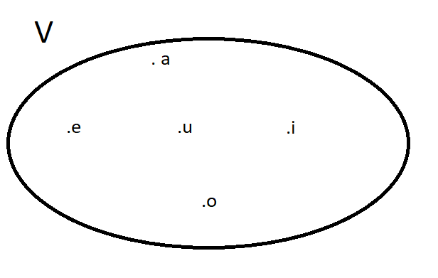

## Teoría de conjunto
- Es una lista o colección de objetos bien definidos que tienen algo en común y de cualquier tipo. Los objetos son los elementos del conjunto.
### Notación
- Para los conjuntos letra mayúscula A,B,G,H, ...
- Para los elementos letra minúscula a,b,g,h, ...
### Conjunto vacío
- Es el conjunto que no posee elementos
- Se representa como ∅
### Pertenencia
- si x es un elemento del conjunto A, entonces x pertenece a A, x ∈ A.
- si x no es un elemento del conjunto A, entonces x no pertenece a A, x ∉ A.
### Formas de representación
1. Por extensión: enumerando todos y cada uno de sus elementos ej el conjunto V posee como elementos a las vocales  V= {a,e,i,o,u}
el conjunto P posee como elementos a los números pares   P={2,4,6,8,...}

2. Por comprensión: diciendo cuál es la propiedad que los caracteriza  ej el conjunto V posee como elementos a las vocales V={vocales} o V={x:x es vocal} V es el conjunto de todas las x tal que x es vocal   : = tal que
el conjunto P posee como elementos a los números pares  P={pares}  P={x:x es par}
práctica - A={1,2,3,4,5}   ==>  A={x ∈ N : x <= 5}
B={...,−3,−2,−1,0,1,2,3,4,5}  ==>   B={x ∈ Z : x <= 5}
C={−2,−1,0,1,2,3,4}   ==>  C={x ∈ Z : -2 <= x <= 4}
### Diagrama de Venn
- Representación gráfica de los conjuntos y sus elementos. El o los conjuntos se dibujan como un círculo u óvalo y sus elementos con un punto (.) y escribiendo el elemento.

### Cardinal de un conjunto
- Es la cantidad de elementos que posee un conjunto. Se denota con # ej V={a,e,i,o,u} ==>  #V=5
L={x:x es letra del alfabeto} ==>  #L=27
P={2,4,6,8,...}  ==> #P=∞