## Teoría de conjunto
- Es una lista o colección de objetos bien definidos que tienen algo en común y de cualquier tipo. Los objetos son los elementos del conjunto.
### Notación
- Para los conjuntos letra mayúscula A,B,G,H, ...
- Para los elementos letra minúscula a,b,g,h, ...
### Conjunto vacío
- Es el conjunto que no posee elementos
- Se representa como ∅ o {}
### Pertenencia
- si x es un elemento del conjunto A, entonces x pertenece a A, x ∈ A.
- si x no es un elemento del conjunto A, entonces x no pertenece a A, x ∉ A.
### Formas de representación
1. Por extensión: enumerando todos y cada uno de sus elementos ej el conjunto V posee como elementos a las vocales  V= {a,e,i,o,u}
el conjunto P posee como elementos a los números pares   P={2,4,6,8,...}

2. Por comprensión: diciendo cuál es la propiedad que los caracteriza  ej el conjunto V posee como elementos a las vocales V={vocales} o V={x:x es vocal} V es el conjunto de todas las x tal que x es vocal   : = tal que
el conjunto P posee como elementos a los números pares  P={pares}  P={x:x es par}
práctica - A={1,2,3,4,5}   ==>  A={x ∈ N : x <= 5}
B={...,−3,−2,−1,0,1,2,3,4,5}  ==>   B={x ∈ Z : x <= 5}
C={−2,−1,0,1,2,3,4}   ==>  C={x ∈ Z : -2 <= x <= 4}

### Diagrama de Venn
- Representación gráfica de los conjuntos y sus elementos. El o los conjuntos se dibujan como un círculo u óvalo y sus elementos con un punto (.) y escribiendo el elemento. Los círculos u óvalos se superponen para ver si tienen una intersección.

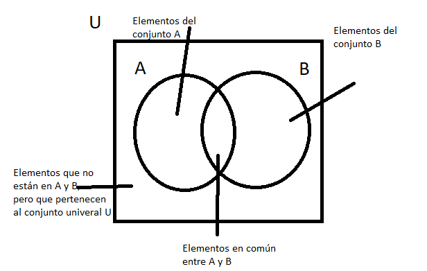
### Cardinal de un conjunto
- Es la cantidad de elementos que posee un conjunto. Se denota con # ej V={a,e,i,o,u} ==>  #V=5
L={x:x es letra del alfabeto} ==>  #L=27
P={2,4,6,8,...}  ==> #P=∞
### Relaciones entre conjuntos
1. Igualdad
- Se dice que A=B si tienen los mismos elementos, sin importar si los elementos se repiten y/o están ordenados de diferentes formas
ej C={1,2,3,4}, D={4,3,1,2,3,1}, E={1,3,1,2,4,2,1}  ==>  C=D=E
2. Desigualdad
A≠B si no hay elementos iguales
3. Inclusión
- Un conjunto A está incluido en un conjunto B, si todo elemento de A también está en B  A⊆B, también se dice A es subconjunto de B
  - Subconjunto propio
   - B es subconjunto de A, si B es subconjunto y tiene menos elementos que A.  B⊊A  sería B⊆A y B≠A
### Conjunto Universal
- Es el conjunto que agrupa a todos los conjuntos. Se denota con U con un rectángulo en el diagrama de Venn
- Sus elementos dependeran de lo que se esté desarrollando.
ej A={1,4,7}  su conjunto universal puede ser variado, como, los números naturales, los números enteros o el conjunto {1,2,3,4,5,6,7,8,9} o cualquier otro conjunto.

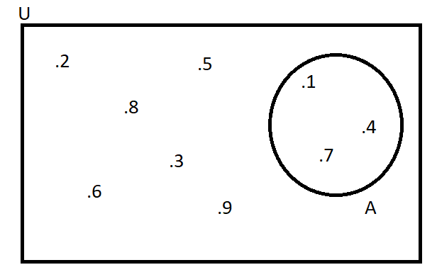
### Operaciones entre conjuntos

1. Unión: la unión de A∪B(A unión B) son todos los elementos de A, también todos los elementos de B y también los elementos comunes entre A y B
ej A={b,i,r,o,m,e} y B={j,p,e} ==>  A∪B ={b,i,r,o,m,e,j,p}

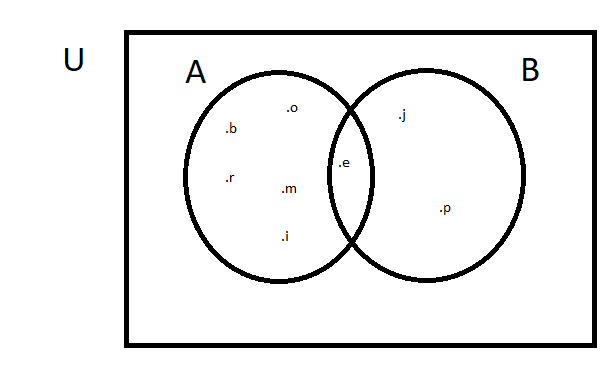
ej C={1,3,5}, D={2,4,6} y E={7}  ==> C∪D∪E={1,2,3,4,5,6,7}

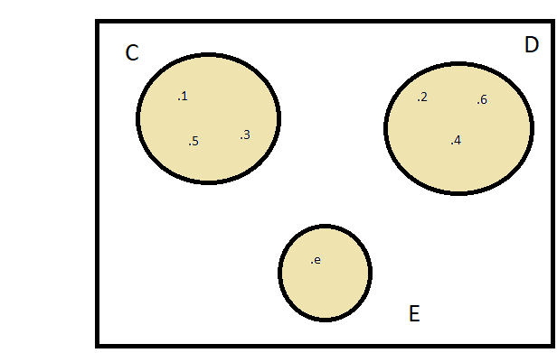
ej A={1,2,3} y B={1}  B⊊A ==>  A∪B=A  ==> porque todos los elementos B están dentro del conjunto A

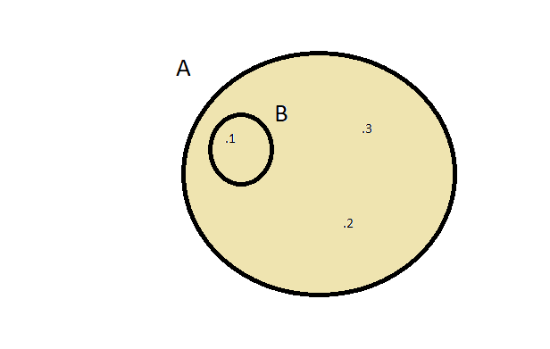

2. Intersección: son los elementos que tienen en común todos los conjuntos
A∩B A intersección B  y en símbolos  A∩B={x:x∈A y x∈B}
ej A={b,i,r,o,m,e} y B={j,p,e} ==> A∩B={e}

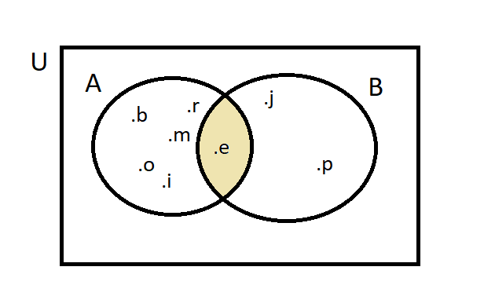
ej P={1,2,3,4,5,6}, Q{5,6,7,9} y R{4,5,6,9,10}
P∩Q∩R ={5,6}

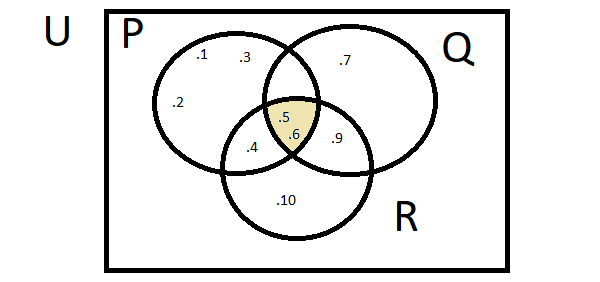
ej A={1,2,3} y B={1} B⊊A ==> A∩B=B ==> porque todos los elementos B están dentro del conjunto A

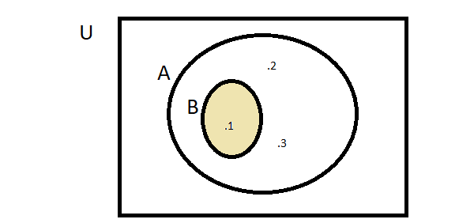

3. Diferencia: son aquellos elementos que están en un conjunto pero que NO pertenecen a los otros conjuntos
A-B   A-B={x:x∈A y x∉B} y de esto se deduce que A-B⊊A
ej A={b,i,r,o,m,e} y B={j,p,e}  A-B={b,i,r,o,m}

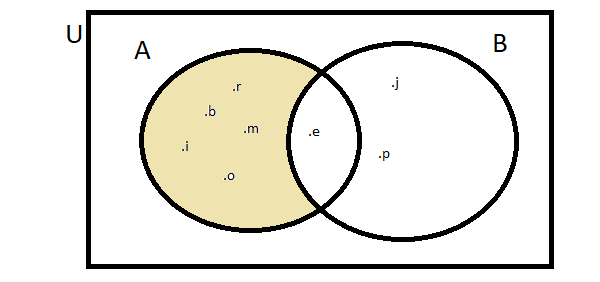
PERO NO ES LO MISMO A-B QUE B-A
B-A={j,p}

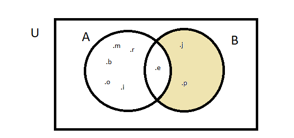
4. Complemento: son aquellos elementos que solo pertenecen a los demás conjuntos y NO al conjunto mencionado o que NO pertenecen a la operación descripta.
ej U-A ==> es el complemento de A respecto de U ==> Ac
ej U={a,e,i,o,u} y A={e,i} ==> Ac=U-A={a,o,u}

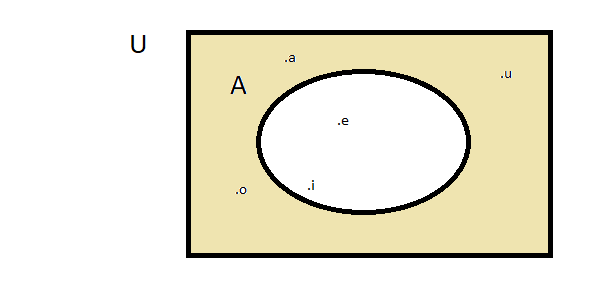

ej conjunto A y conjunto B
Complemento de A  Ac

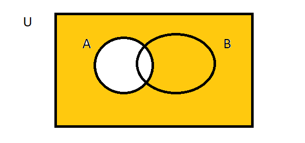
ej conjunto A y conjunto B
Complemento de B  Bc

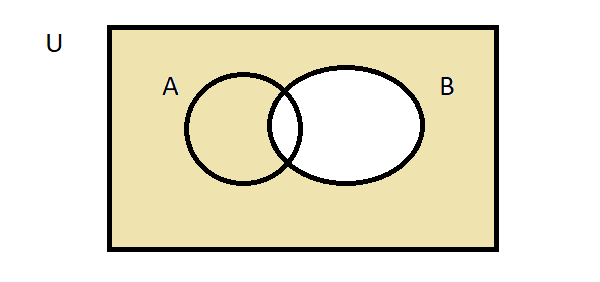
ej conjunto A y conjunto B
Complemento de A∩B

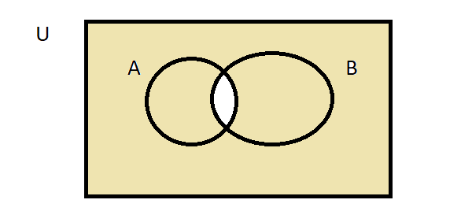
ej conjunto A y conjunto B
Complemento de A∪B

